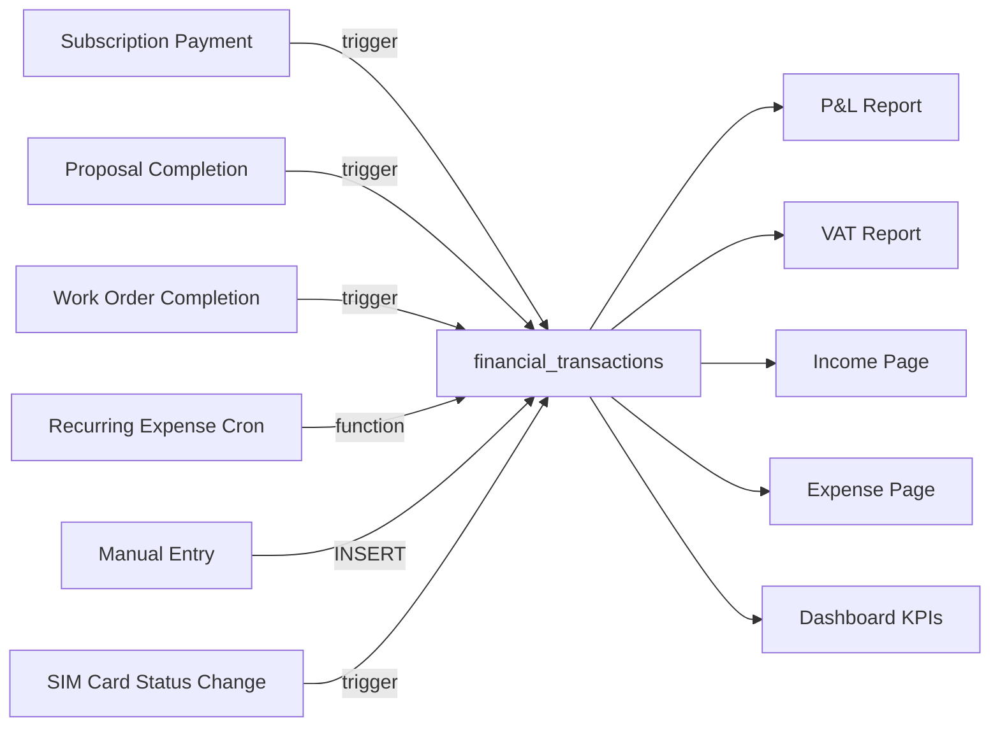

# MODULE_FINANCE — Single Ledger Architecture

> Route: `/finance/*` (7 pages) | Migrations: 00040–00053, 00070, 00154 | Access: admin + accountant

---

## Core Principle

`financial_transactions` is the **single source of truth** for all money movement. Every financial report (P&L, dashboard, VAT, income page, expense page) reads ONLY from this table.



---

## Schema: `financial_transactions`

```sql
CREATE TABLE financial_transactions (
  id                    UUID PRIMARY KEY DEFAULT gen_random_uuid(),
  direction             TEXT NOT NULL CHECK (direction IN ('income', 'expense')),
  income_type           TEXT,              -- 'subscription' | 'sale' | 'service' | 'sim_rental' | NULL(expense)
  expense_category_id   UUID REFERENCES expense_categories(id),

  -- Amounts
  amount_original       DECIMAL(12,2) NOT NULL,
  original_currency     TEXT DEFAULT 'TRY',
  amount_try            DECIMAL(12,2) NOT NULL,
  exchange_rate         DECIMAL(12,6) DEFAULT 1.0,
  cogs_try              DECIMAL(12,2) DEFAULT 0,  -- Cost of goods sold (for gross margin)

  -- VAT
  output_vat            DECIMAL(12,2) DEFAULT 0,  -- KDV on income
  input_vat             DECIMAL(12,2) DEFAULT 0,   -- KDV on expense
  vat_rate              DECIMAL(5,2) DEFAULT 20,

  -- Invoice tracking
  should_invoice        BOOLEAN,           -- Income: should we invoice?
  has_invoice           BOOLEAN,           -- Expense: do we have invoice?
  invoice_no            TEXT,
  invoice_type          TEXT,              -- 'e_fatura' | 'e_arsiv'
  invoice_date          DATE,
  parasut_invoice_id    TEXT,

  -- Links (all optional — set by triggers)
  customer_id           UUID REFERENCES customers(id),
  site_id               UUID REFERENCES customer_sites(id),
  work_order_id         UUID REFERENCES work_orders(id),
  proposal_id           UUID REFERENCES proposals(id),
  subscription_payment_id UUID REFERENCES subscription_payments(id),
  recurring_template_id UUID REFERENCES recurring_expense_templates(id),

  -- Metadata
  status                TEXT DEFAULT 'confirmed' CHECK (status IN ('pending', 'confirmed')),
  period                TEXT,              -- Auto: 'YYYY-MM'
  transaction_date      DATE NOT NULL DEFAULT CURRENT_DATE,
  description           TEXT,
  payment_method        TEXT,
  reference_no          TEXT,
  created_by            UUID REFERENCES profiles(id),
  created_at            TIMESTAMPTZ DEFAULT now(),
  updated_at            TIMESTAMPTZ DEFAULT now()
);
```

### Direction Constraint

```sql
-- Income rows: should_invoice allowed, has_invoice must be NULL
-- Expense rows: has_invoice allowed, should_invoice must be NULL
CHECK (
  (direction = 'income'  AND has_invoice IS NULL) OR
  (direction = 'expense' AND should_invoice IS NULL)
)
```

---

## 4 Automated Input Streams

### Stream 1: Subscription Payment → Finance

**Trigger:** `fn_subscription_payment_to_finance()`
**Fires:** AFTER UPDATE on `subscription_payments` WHEN `status` changes to `'paid'`
**Migration:** 00050, updated in 00154

```
INPUT:  subscription_payments row (status → 'paid')
        + parent subscription (base_price, sms_fee, line_fee, static_ip_fee, sim_amount, cost, billing_frequency, vat_rate)

GUARD:  Idempotency check — skip if financial_transactions row exists for this payment

MULTIPLIER (billing_frequency → COGS multiplier):
  'yearly'   → 12
  '6_month'  → 6
  '3_month'  → 3
  'monthly'  → 1

OUTPUT 1 — INCOME ROW:
  direction      = 'income'
  income_type    = 'subscription'
  amount_try     = payment.amount (NET, already multiplied by frontend)
  output_vat     = payment.vat_amount
  vat_rate       = subscription.vat_rate (default 20)
  cogs_try       = subscription.cost × multiplier
  should_invoice = true

OUTPUT 2 — COGS EXPENSE ROW (if cogs > 0):
  direction          = 'expense'
  expense_category   = 'subscription_cogs'
  amount_try         = subscription.cost × multiplier
  input_vat          = ROUND(cogs × (vat_rate / 100), 2)
  has_invoice        = true
```

### Stream 2: Proposal Completion → Finance

**Trigger:** `auto_record_proposal_revenue()`
**Fires:** AFTER UPDATE on `proposals` WHEN `status` changes to `'completed'`
**Migration:** 00045, updated in 00052, 00154

```
INPUT:  proposals row (status → 'completed')
        + proposal_items (cost columns)
        + exchange_rates (latest USD/TRY)

GUARDS:
  1. Idempotency — skip if income row exists for this proposal
  2. No revenue — skip if total_amount ≤ 0
  3. No site — skip if site_id IS NULL

CURRENCY CONVERSION:
  proposals.currency (default USD)
  IF currency = 'TRY' → rate = 1.0
  IF currency = 'USD' → rate = latest exchange_rates.effective_rate (fallback 1.0)
  amount_try = total_amount × rate

COGS CALCULATION:
  Per item: COALESCE(cost, cost_usd) × quantity
  = SUM(product_cost + labor_cost + material_cost + shipping_cost + misc_cost) per line

OUTPUT 1 — INCOME ROW:
  direction      = 'income'
  income_type    = 'sale'
  amount_try     = total × rate
  output_vat     = ROUND(amount_try × (vat_rate / 100), 2)
  vat_rate       = 20 (hardcoded fallback, proposals table has no vat_rate column yet)
  cogs_try       = total_cogs × rate
  should_invoice = true
  proposal_id    = proposals.id

OUTPUT 2 — COGS EXPENSE ROW (if cogs > 0):
  direction          = 'expense'
  expense_category   = 'material'
  amount_try         = cogs × rate
```

### Stream 3: Work Order Completion → Finance

**Trigger:** `auto_record_work_order_revenue()`
**Fires:** AFTER UPDATE on `work_orders` WHEN `status` changes to `'completed'`
**Migration:** 00046, updated in 00052, 00154

```
INPUT:  work_orders row (status → 'completed')
        + work_order_materials (unit_price, cost columns)
        + exchange_rates (latest rate)

GUARDS:
  1. ██ CRITICAL GUARD (Rule 18) ██
     IF NEW.proposal_id IS NOT NULL THEN RETURN NEW
     → Proposal-linked WOs are SKIPPED. Revenue handled by proposal trigger.

  2. Idempotency — skip if income row exists for this WO
  3. No site — skip if site_id IS NULL
  4. No amount — skip if amount ≤ 0 AND no materials with revenue

REVENUE CALCULATION:
  IF work_orders.amount > 0 → use amount directly
  ELSE → compute from work_order_materials: SUM(quantity × unit_price × (1 - discount/100))

COGS CALCULATION:
  From work_order_materials: SUM(COALESCE(cost, cost_usd) × quantity)

OUTPUT 1 — INCOME ROW:
  direction      = 'income'
  income_type    = 'service'
  amount_try     = revenue × rate
  output_vat     = ROUND(amount_try × (vat_rate / 100), 2)
  vat_rate       = 20 (hardcoded fallback)
  cogs_try       = total_cogs × rate
  should_invoice = true
  work_order_id  = work_orders.id

OUTPUT 2 — COGS EXPENSE ROW (if cogs > 0):
  direction          = 'expense'
  expense_category   = 'material'
  amount_try         = cogs × rate
```

### Stream 4: Recurring Expenses (Cron)

**Function:** `fn_generate_recurring_expenses()`
**Schedule:** Daily at 01:00 UTC (`cron: '0 1 * * *'`)
**Migration:** 00070

```
FOR EACH active template in recurring_expense_templates:
  IF no transaction exists for current month + template:
    INSERT expense transaction:
      direction     = 'expense'
      status        = 'pending'  ← requires manual confirmation
      amount_try    = template.amount
      input_vat     = ROUND(amount × (vat_rate / 100), 2) if has_invoice
      transaction_date = LEAST(day_of_month, last_day_of_month)

  IF pending expenses exist → create/update notification
  IF all confirmed → resolve notification
```

---

## Stream 5: SIM Card Status Change → Finance

**Trigger:** `fn_sim_card_to_finance()`
**Fires:** AFTER UPDATE on `sim_cards` (status change only, not INSERT)
**Migration:** 00154

```
GUARDS:
  - Skip if status = 'subscription' (handled by subscription trigger)
  - Skip if status = 'cancelled'

IF cost_price > 0:
  INSERT expense: direction='expense', category='sim_operator', amount=cost_price

IF status = 'active' AND sale_price > 0 AND site has no active subscription:
  INSERT income: direction='income', income_type='sim_rental', amount=sale_price, cogs_try=cost_price
```

---

## VAT Rules

```
PRECISION:     DECIMAL(5,2) for rate, DECIMAL(12,2) for amounts
CALCULATION:   ROUND(amount × (vat_rate / 100.0), 2)    ← explicit .0 to avoid integer division
STORAGE:       output_vat (income), input_vat (expense)  ← never both on same row
SOURCE:        subscription.vat_rate → dynamic (default 20)
               proposal, work_order  → hardcoded 20 (no vat_rate column yet)
               recurring_template   → template.vat_rate (default 20)
```

**CONSTRAINT:** Never hardcode `0.20` or `20` in application code. Always read `vat_rate` from the source record.

**CONSTRAINT:** All `base_price`, `sms_fee`, `line_fee`, `static_ip_fee`, `sim_amount` are **NET (KDV haric)**. VAT is always computed and stored separately.

---

## Exchange Rates

**Table:** `exchange_rates`
**Source:** TCMB (Turkish Central Bank)
**Auto-fetch:** Supabase Edge Function (cron, daily)

```sql
-- Lookup pattern used by all triggers:
SELECT effective_rate INTO v_rate
FROM exchange_rates
WHERE currency = v_currency
ORDER BY rate_date DESC
LIMIT 1;

v_rate := COALESCE(v_rate, 1.0);  -- fallback: no conversion
```

---

## Expense Categories (seeded)

| Slug | Turkish Label | Auto-populated By |
|------|---------------|-------------------|
| `material` | Malzeme | Proposal/WO COGS triggers |
| `subscription_cogs` | Abonelik Maliyeti | Subscription payment trigger |
| `sim_operator` | SIM Operatör | SIM card trigger |
| `sgk` | SGK | Recurring |
| `tax_withholding` | Stopaj | Recurring |
| `accounting` | Muhasebe | Recurring |
| `fuel` | Yakıt | Manual |
| `payroll` | Maaş | Recurring |
| `rent` | Kira | Recurring |
| `utilities` | Faturalar | Recurring |
| `vehicle` | Araç | Manual |
| `insurance` | Sigorta | Recurring |
| `software` | Yazılım | Recurring |

---

## Frontend Pages (7)

| Route | Component | Data Source |
|-------|-----------|------------|
| `/finance` | FinanceDashboardPage | `financeDashboardKeys` (RPC) |
| `/finance/income` | IncomePage | `transactionKeys` (direction='income') |
| `/finance/expenses` | ExpensesPage | `transactionKeys` (direction='expense') |
| `/finance/vat` | VatReportPage | `vatReportKeys` (RPC) |
| `/finance/exchange` | ExchangeRatePage | `rateKeys` |
| `/finance/recurring` | RecurringExpensesPage | `transactionKeys` + templates |
| `/finance/reports` | ReportsPage | `profitAndLossKeys` (RPC) |

### Collection Desk (under subscriptions)

| Route | Component | Data Source |
|-------|-----------|------------|
| `/subscriptions/collection` | CollectionDeskPage | `collectionKeys` (custom query) |

**Cross-module invalidation on payment:**
```
collectionKeys.all → subscriptionKeys.all → transactionKeys.lists()
→ financeDashboardKeys.all → profitAndLossKeys.all
```

---

## CONSTRAINTS (what an AI must NOT do)

1. **Never query `subscription_payments` for financial reporting.** Always use `financial_transactions`.
2. **Never bypass Rule 18.** Work orders with `proposal_id IS NOT NULL` MUST be skipped by `auto_record_work_order_revenue`. Revenue is handled by the proposal trigger.
3. **Never hardcode VAT rate** in application code. Read from the source record's `vat_rate` column.
4. **Never store gross amounts.** All amount fields are NET. VAT is computed and stored in `output_vat` / `input_vat`.
5. **Never set both `should_invoice` and `has_invoice`** on the same row. Income uses `should_invoice`, expense uses `has_invoice`.
6. **Never insert into `financial_transactions` from frontend** for subscription/proposal/WO revenue. These are trigger-populated. Frontend only inserts manual entries.
7. **Never skip idempotency checks** when modifying triggers. All triggers check for existing rows before INSERT.
8. **Never use float for money.** Always `DECIMAL(12,2)` for amounts, `DECIMAL(5,2)` for rates.
