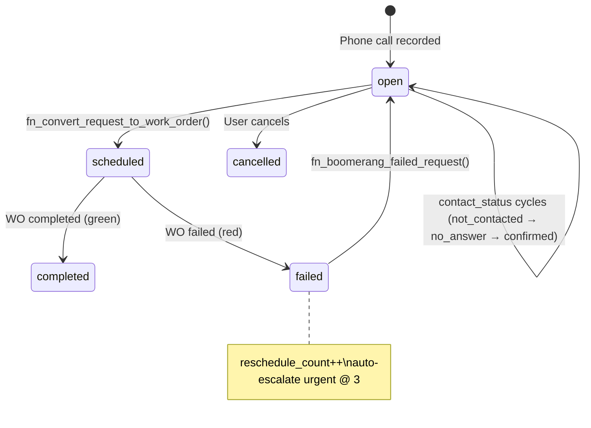

# MODULE_OPERATIONS — Operations Board (Operasyon Merkezi)

> Route: `/operations` | Migration: `00160_service_requests.sql` | Access: admin + accountant

---

## Data Lifecycle



### Two-Table Separation

| Concern | Table | Purpose |
|---------|-------|---------|
| Phone notes | `service_requests` | Lightweight. 3 required fields. No form_no, no materials. |
| Execution | `work_orders` | Heavy. form_no, materials, finance triggers, scheduling. |

**RULE:** Service requests NEVER trigger finance. Only work_orders do.

**RULE:** Conversion is one-way. Requests create WOs. WOs do not create requests.

---

## Schema: `service_requests`

```sql
CREATE TABLE service_requests (
  id                UUID PRIMARY KEY DEFAULT gen_random_uuid(),
  customer_id       UUID NOT NULL REFERENCES customers(id),
  site_id           UUID REFERENCES customer_sites(id),
  description       TEXT NOT NULL,
  region            TEXT NOT NULL DEFAULT 'istanbul_europe',   -- CHECK: istanbul_europe | istanbul_anatolia | outside_istanbul
  priority          TEXT NOT NULL DEFAULT 'normal',            -- CHECK: low | normal | high | urgent
  work_type         TEXT NOT NULL DEFAULT 'service',           -- CHECK: survey | installation | service | maintenance | other
  contact_status    TEXT NOT NULL DEFAULT 'not_contacted',     -- CHECK: not_contacted | no_answer | confirmed | cancelled
  contact_attempts  INT NOT NULL DEFAULT 0,
  last_contact_at   TIMESTAMPTZ,
  contact_notes     TEXT,
  status            TEXT NOT NULL DEFAULT 'open',              -- CHECK: open | scheduled | completed | failed | cancelled
  work_order_id     UUID REFERENCES work_orders(id),           -- Set on conversion
  scheduled_date    DATE,                                      -- Set on conversion
  scheduled_time    TIME,                                      -- Set on conversion
  failure_reason    TEXT,
  reschedule_count  INT NOT NULL DEFAULT 0,
  created_by        UUID REFERENCES profiles(id),
  created_at        TIMESTAMPTZ NOT NULL DEFAULT now(),
  updated_at        TIMESTAMPTZ NOT NULL DEFAULT now(),
  deleted_at        TIMESTAMPTZ                                -- Soft delete
);
```

### Indexes (6 partial)

| Index | Columns | WHERE | Purpose |
|-------|---------|-------|---------|
| `idx_sr_status_open` | status | `deleted_at IS NULL AND status='open'` | Pool queries |
| `idx_sr_region` | region | `deleted_at IS NULL AND status='open'` | Region filter |
| `idx_sr_contact_status` | contact_status | `deleted_at IS NULL AND status='open'` | Contact filter |
| `idx_sr_scheduled_date` | scheduled_date | `status='scheduled'` | Calendar tab |
| `idx_sr_customer` | customer_id | `deleted_at IS NULL` | Customer lookup |
| `idx_sr_work_order` | work_order_id | `work_order_id IS NOT NULL` | WO back-link |

### RLS

```
SELECT:  all authenticated (WHERE deleted_at IS NULL)
INSERT:  admin + accountant
UPDATE:  admin + accountant
DELETE:  not implemented (soft delete only)
```

---

## Contact Status (Traffic Light)

```
not_contacted (RED)    →  New request, not yet called
no_answer     (YELLOW) →  Called, no response. contact_attempts++
confirmed     (GREEN)  →  Customer confirmed. Ready to schedule.
cancelled     (GRAY)   →  Customer cancelled. Terminal state.
```

**Frontend mapping:**

```javascript
// ContactStatusBadge.jsx
{ not_contacted: 'error', no_answer: 'warning', confirmed: 'success', cancelled: 'default' }
```

**CONSTRAINT:** The "Planla" (Schedule) button only appears when `contact_status === 'confirmed'`.

---

## RPC: `fn_convert_request_to_work_order`

### Signature

```sql
fn_convert_request_to_work_order(
  p_request_id     UUID,
  p_scheduled_date DATE,
  p_scheduled_time TIME    DEFAULT NULL,
  p_work_type      TEXT    DEFAULT NULL,
  p_notes          TEXT    DEFAULT NULL,
  p_user_id        UUID    DEFAULT NULL
) RETURNS UUID  -- returns new work_order.id
```

### Guards (in order)

```
1. SELECT FOR UPDATE (row lock)
2. Request not found         → RAISE EXCEPTION
3. status != 'open'          → RAISE EXCEPTION
4. contact_status != 'confirmed' → RAISE EXCEPTION
```

### Side Effects

```
1. INSERT INTO work_orders:
   - work_type   = COALESCE(p_work_type, request.work_type)
   - status      = 'scheduled'
   - site_id     = request.site_id
   - description = request.description
   - priority    = request.priority
   - form_no     = NULL (user fills later)

2. UPDATE service_requests:
   - status         = 'scheduled'
   - work_order_id  = new WO id
   - scheduled_date = p_scheduled_date
   - scheduled_time = p_scheduled_time
```

### Frontend Call

```javascript
// hooks.js → useConvertToWorkOrder
convertMutation.mutate({
  requestId: request.id,
  scheduleData: { scheduled_date, scheduled_time, work_type, notes }
});
// Invalidates: serviceRequestKeys.lists(), serviceRequestKeys.stats(), workOrderKeys.lists()
```

---

## RPC: `fn_boomerang_failed_request`

### Signature

```sql
fn_boomerang_failed_request(
  p_request_id     UUID,
  p_failure_reason TEXT    DEFAULT NULL,
  p_user_id        UUID    DEFAULT NULL
) RETURNS void
```

### Guards

```
1. SELECT FOR UPDATE (row lock)
2. Request not found              → RAISE EXCEPTION
3. status NOT IN ('scheduled', 'failed') → RAISE EXCEPTION
```

### Side Effects

```
1. UPDATE work_orders (linked WO):
   - status     = 'cancelled'
   - notes      += '[Otomatik iptal: ... failure_reason]'
   - ONLY IF status NOT IN ('completed')

2. UPDATE service_requests:
   - status           = 'open'          ← back to pool
   - contact_status   = 'not_contacted' ← reset traffic light
   - work_order_id    = NULL            ← unlink WO
   - scheduled_date   = NULL
   - scheduled_time   = NULL
   - failure_reason   = p_failure_reason
   - reschedule_count = reschedule_count + 1

3. AUTO-ESCALATION:
   - IF reschedule_count >= 3 AND priority != 'urgent'
   - THEN SET priority = 'urgent'
```

### Failure Reason Enum (frontend)

```javascript
FAILURE_REASONS = ['customer_absent', 'parts_needed', 'access_denied', 'incomplete_work', 'other']
```

---

## RPC: `fn_get_operations_stats`

### Signature

```sql
fn_get_operations_stats(
  p_date_from DATE DEFAULT start_of_current_month,
  p_date_to   DATE DEFAULT today
) RETURNS JSON
```

### Return Shape

```json
{
  "pool": {
    "total_open": 12,
    "not_contacted": 4,
    "no_answer": 3,
    "confirmed": 5,
    "by_region": {
      "istanbul_europe": 5,
      "istanbul_anatolia": 4,
      "outside_istanbul": 3
    }
  },
  "period": {
    "scheduled": 8,
    "completed": 20,
    "failed": 3,
    "cancelled": 1,
    "success_rate": 87.0,
    "avg_reschedules": 0.3,
    "total_requests": 32
  }
}
```

`pool` = live snapshot (current open requests, no date filter).
`period` = date-filtered aggregation over `created_at`.

---

## Region Detection Logic

Auto-detected from `customer_sites.city` and `customer_sites.district` on request creation.

```javascript
function detectRegion(city, district) {
  const istanbul = normalizeForSearch(city) === 'istanbul';
  if (!istanbul) return 'outside_istanbul';

  const europeanDistricts = [
    'fatih', 'beyoglu', 'sisli', 'besiktas', 'bakirkoy',
    'bayrampasa', 'eyupsultan', 'kagithane', 'sariyer',
    'zeytinburnu', 'gungoren', 'esenler', 'bagcilar',
    'bahcelievler', 'avcilar', 'kucukcekmece', 'buyukcekmece',
    'basaksehir', 'sultangazi', 'arnavutkoy', 'catalca',
    'esenyurt', 'beylikduzu', 'silivri'
  ];

  return europeanDistricts.includes(normalizeForSearch(district))
    ? 'istanbul_europe'
    : 'istanbul_anatolia';
}
```

**RULE:** Uses `normalizeForSearch()` for Turkish character normalization before comparison.

**RULE:** Region is stored on the request. Manual override is available via dropdown.

---

## Frontend Architecture

### Component Tree

```
OperationsBoardPage.jsx          ← Tab container, URL state (?tab=pool|calendar|insights)
├── RequestPoolTab.jsx           ← Tab 1: filters + card grid + call queue trigger
│   ├── QuickEntryRow.jsx        ← Customer combobox → site → description → Enter
│   ├── RequestCard.jsx          ← Card with badges, menu, scheduler trigger
│   │   ├── ContactStatusBadge   ← Traffic light dot badge
│   │   ├── RegionBadge          ← Region label badge
│   │   └── InlineScheduler.jsx  ← Expandable: date/time/type → fn_convert RPC
│   └── CallQueueModal.jsx       ← Full-screen batch calling mode
├── CalendarTab.jsx              ← Tab 2: react-big-calendar (read-only, WOs only)
└── InsightsTab.jsx              ← Tab 3: KPI cards + breakdowns (fn_get_operations_stats)
```

### Query Key Usage

```javascript
serviceRequestKeys = {
  all: ['service_requests'],
  lists: () => [...all, 'list'],
  list: (filters) => [...lists(), filters],
  details: () => [...all, 'detail'],
  detail: (id) => [...details(), id],
  stats: (filters) => [...all, 'stats', filters],
};
```

### API Functions (10)

| Function | Method | Purpose |
|----------|--------|---------|
| `fetchServiceRequests(filters)` | SELECT | Pool list with joins |
| `fetchServiceRequest(id)` | SELECT | Single detail |
| `createServiceRequest(data)` | INSERT | Quick entry (sets created_by) |
| `updateServiceRequest({id, ...})` | UPDATE | Edit fields |
| `deleteServiceRequest(id)` | UPDATE deleted_at | Soft delete |
| `updateContactStatus(id, status, notes)` | UPDATE | Traffic light + attempts++ |
| `convertRequestToWorkOrder(id, schedule)` | RPC | Atomic conversion |
| `boomerangRequest(id, reason)` | RPC | Failed → pool |
| `fetchOperationsStats(from, to)` | RPC | Insights aggregation |
| `cancelServiceRequest(id)` | UPDATE | Set status+contact to cancelled |

### Hooks (10)

| Hook | Type | Cross-Module Invalidation |
|------|------|---------------------------|
| `useServiceRequests(filters)` | query | — |
| `useServiceRequest(id)` | query | — |
| `useOperationsStats(from, to)` | query | — |
| `useCreateServiceRequest()` | mutation | serviceRequestKeys |
| `useUpdateServiceRequest()` | mutation | serviceRequestKeys |
| `useUpdateContactStatus()` | mutation | serviceRequestKeys |
| `useConvertToWorkOrder()` | mutation | serviceRequestKeys + **workOrderKeys** |
| `useBoomerangRequest()` | mutation | serviceRequestKeys + **workOrderKeys** |
| `useDeleteServiceRequest()` | mutation | serviceRequestKeys |
| `useCancelServiceRequest()` | mutation | serviceRequestKeys |

### Zod Schemas (4)

```javascript
quickEntrySchema = { customer_id: uuid, site_id?: string, description: min(1), region, priority, work_type }
scheduleSchema   = { scheduled_date: min(1), scheduled_time?: string, work_type, notes?: string }
contactUpdateSchema = { contact_status: enum, contact_notes?: string }
failureSchema    = { failure_reason: enum }
```

---

## View: `service_requests_detail`

```sql
SELECT sr.*,
  c.company_name AS customer_name, c.phone AS customer_phone,
  cs.site_name, cs.account_no, cs.city, cs.district, cs.contact_phone AS site_contact_phone,
  p.full_name AS created_by_name,
  wo.form_no AS work_order_form_no, wo.status AS work_order_status
FROM service_requests sr
LEFT JOIN customers c ON c.id = sr.customer_id
LEFT JOIN customer_sites cs ON cs.id = sr.site_id
LEFT JOIN profiles p ON p.id = sr.created_by
LEFT JOIN work_orders wo ON wo.id = sr.work_order_id
WHERE sr.deleted_at IS NULL;
```

**NOTE:** Frontend does NOT use this view. It uses `supabase.from('service_requests').select(REQUEST_DETAIL_SELECT)` with inline joins:

```javascript
const REQUEST_DETAIL_SELECT = `
  *,
  customers:customer_id ( id, company_name, phone ),
  customer_sites:site_id ( id, site_name, account_no, city, district, contact_phone ),
  profiles:created_by ( full_name ),
  work_orders:work_order_id ( id, form_no, status )
`;
```

---

## CONSTRAINTS (what an AI must NOT do)

1. **Never create a work_order directly for a phone call.** Always create a `service_request` first, then convert via RPC.
2. **Never set `service_request.status = 'scheduled'` without calling `fn_convert_request_to_work_order`.** The RPC atomically creates the WO and links it.
3. **Never skip the `contact_status = 'confirmed'` guard.** The RPC will reject it.
4. **Never delete a service_request with `DELETE`.** Use soft delete (`deleted_at = now()`).
5. **Never hardcode region.** Use `detectRegion(city, district)` from the site's address.
6. **Never call boomerang on a completed request.** Guard: status must be `scheduled` or `failed`.
7. **Never show the "Planla" button** unless `contact_status === 'confirmed'`.
8. **Calendar tab is read-only.** No drag-drop, no slot selection. Scheduling happens in Tab 1 only.
