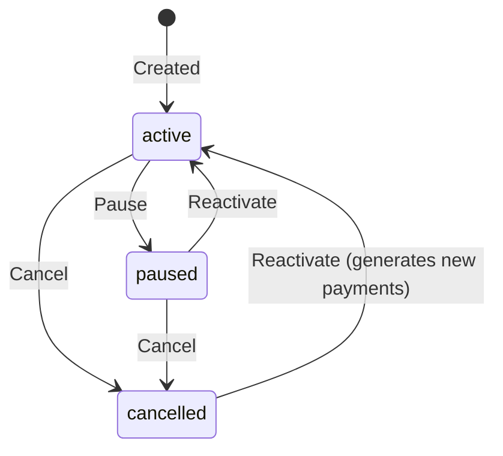

# MODULE_SUBSCRIPTIONS — Billing, SIM Sync, Collection

> Route: `/subscriptions/*` | Migrations: 00016, 00037, 00050, 00055, 00109, 00140, 00151, 00153 | Access: admin + accountant

---

## Pricing Model

All price columns are **monthly NET (KDV haric)**. Never store gross amounts.

```
Monthly Subtotal = base_price + sms_fee + line_fee + static_ip_fee + sim_amount
Monthly VAT      = ROUND(subtotal × (vat_rate / 100), 2)
Monthly Total    = subtotal + vat

MRR = SUM(base_price + sms_fee + line_fee)   ← NO division, NO VAT, NO cost
```

### Column Types

| Column | Type | Purpose | Added |
|--------|------|---------|-------|
| `base_price` | DECIMAL(10,2) | Core monthly fee | 00016 |
| `sms_fee` | DECIMAL(10,2) | Monthly SMS fee | 00016 |
| `line_fee` | DECIMAL(10,2) | Monthly line fee | 00016 |
| `static_ip_fee` | NUMERIC(12,2) | Monthly static IP fee | 00090 |
| `sim_amount` | DECIMAL(10,2) | Monthly SIM fee | 00140 |
| `cost` | DECIMAL(10,2) | Monthly operational cost (for COGS) | 00016 |
| `static_ip_cost` | NUMERIC(12,2) | Monthly static IP cost | 00090 |
| `vat_rate` | DECIMAL(5,2) | VAT percentage (default 20) | 00016 |
| `currency` | TEXT | 'TRY' (default) | 00016 |

---

## Billing Frequency Multiplier

```
billing_frequency    payments/year    multiplier    interval
─────────────────    ─────────────    ──────────    ────────
'monthly'            12               1             1 month
'3_month'            4                3             3 months
'6_month'            2                6             6 months
'yearly'             1                12            12 months
```

### Payment Amount Calculation

```sql
-- Payment amount = monthly subtotal × multiplier
v_subtotal := base_price + sms_fee + line_fee + static_ip_fee + sim_amount;
v_vat      := ROUND(v_subtotal * vat_rate / 100, 2);
v_total    := v_subtotal + v_vat;

-- For a 6-month subscription:
payment.amount       = v_subtotal * 6    -- NET for 6 months
payment.vat_amount   = v_vat * 6
payment.total_amount = v_total * 6
```

### Payment Generation RPC

```sql
generate_subscription_payments(p_subscription_id UUID, p_start_date DATE DEFAULT NULL)
```

- Called on subscription creation or reactivation
- Generates 1 year of payment rows
- Uses `ON CONFLICT (subscription_id, payment_month) DO NOTHING` for idempotency
- Payment months: 1st of each billing period

---

## Subscription Lifecycle



### Status Enum

```sql
CHECK (status IN ('active', 'paused', 'cancelled'))
```

### Subscription Type Enum

```sql
CHECK (subscription_type IN ('recurring_card', 'manual_cash', 'manual_bank', 'annual', 'internet_only'))
```

### Service Type (Multi-Service)

```sql
CHECK (service_type IN ('alarm_only', 'camera_only', 'internet_only'))
-- Unique constraint: one active subscription per site per service_type
CREATE UNIQUE INDEX idx_subscriptions_active_site_service
  ON subscriptions (site_id, service_type)
  WHERE status = 'active' AND service_type IS NOT NULL;
```

---

## Payment Status Flow

```
pending   →  paid      (triggers finance: fn_subscription_payment_to_finance)
pending   →  failed    (payment attempt failed)
pending   →  skipped   (month skipped, e.g. paused subscription)
pending   →  write_off (debt written off)
```

### Payment → Finance Trigger

See `MODULE_FINANCE.md` → Stream 1 for exact trigger logic.

**Key point:** When `subscription_payments.status` changes to `'paid'`, the trigger creates:
1. Income row in `financial_transactions` (amount = payment NET)
2. COGS expense row (if subscription.cost > 0)

---

## SIM Card Status Synchronization

### Trigger: `fn_subscription_sim_status_on_update()`

**Fires:** AFTER UPDATE on `subscriptions`
**Migration:** 00153

```
SUBSCRIPTION STATUS CHANGE:
  active → cancelled/paused:
    sim_cards SET status='available', customer_id=NULL, site_id=NULL

  cancelled/paused → active:
    sim_cards SET status='subscription',
      customer_id = (from customer_sites),
      site_id = subscription.site_id

SIM CARD LINK CHANGE (on active/paused subscription):
  sim_card_id added:
    new SIM → status='subscription', link customer/site
  sim_card_id changed:
    old SIM → status='available', unlink
    new SIM → status='subscription', link
  sim_card_id removed:
    old SIM → status='available', unlink
```

### Trigger: `fn_subscription_sim_status_on_insert()`

**Fires:** AFTER INSERT on `subscriptions`
**Migration:** 00055

```
IF sim_card_id IS NOT NULL:
  sim_cards SET status='subscription',
    customer_id = (from customer_sites),
    site_id = subscription.site_id
```

### SIM Card Status Enum

| Status | Meaning |
|--------|---------|
| `available` | Not linked, ready to assign |
| `subscription` | Linked to active/paused subscription |
| `active` | Legacy (manually set, standalone use) |
| `inactive` | Decommissioned |
| `sold` | Sold/transferred |

---

## Bulk Price Revision

### RPC: `bulk_update_subscription_prices(p_updates JSONB)`

**Migration:** 00151

**Input:**
```json
[{
  "id": "subscription-uuid",
  "base_price": 1200,
  "sms_fee": 50,
  "line_fee": 100,
  "static_ip_fee": 0,
  "sim_amount": 200,
  "vat_rate": 20,
  "cost": 500
}]
```

**Logic:**
1. Role guard: admin + accountant only
2. For each subscription:
   - Update price columns on `subscriptions` table
   - Calculate new amounts with billing frequency multiplier
   - Update ALL `pending` payment rows with new amounts
   - Create `audit_logs` entry (action='price_change', old/new values)

**CONSTRAINT:** Only updates `status='pending'` payments. Paid payments are never modified.

---

## Collection Desk

**Route:** `/subscriptions/collection`
**API:** `features/finance/collectionApi.js`

### Query Logic

```sql
-- Fetches ALL pending payments including overdue (no month restriction)
SELECT sp.*, s.*, c.*, cs.*
FROM subscription_payments sp
JOIN subscriptions s ON s.id = sp.subscription_id
JOIN customer_sites cs ON cs.id = s.site_id
JOIN customers c ON c.id = cs.customer_id
WHERE sp.status = 'pending'
  AND s.status != 'cancelled'
ORDER BY sp.payment_month ASC
```

### Display Layout

```
3-column VAT layout per row:
  Net (amount)  |  KDV (vat_amount)  |  Toplam (total_amount)

Overdue badge: payment_month < current month start
Quick Pay: uses subscription's default payment_method
```

### Cache Invalidation on Payment

```javascript
// collectionHooks.js → useCollectionRecordPayment
onSuccess: () => {
  invalidate(collectionKeys.all);
  invalidate(subscriptionKeys.all);
  invalidate(subscriptionKeys.payments(subscription_id));
  invalidate(transactionKeys.lists());
  invalidate(financeDashboardKeys.all);
  invalidate(profitAndLossKeys.all);
}
```

---

## View: `subscriptions_detail`

Key computed columns:

```sql
subtotal     = base_price + sms_fee + line_fee + static_ip_fee + sim_amount
vat_amount   = ROUND(subtotal * vat_rate / 100, 2)
total_amount = ROUND(subtotal * (1 + vat_rate / 100), 2)
profit       = ROUND(total_amount - cost - static_ip_cost, 2)

has_overdue_pending = EXISTS (
  SELECT 1 FROM subscription_payments
  WHERE subscription_id = sub.id
    AND status = 'pending'
    AND payment_month < date_trunc('month', CURRENT_DATE)::date
)
```

Joins: customer_sites, customers, sim_cards (phone), payment_methods, profiles (manager, salesperson, cash_collector).

---

## Frontend Architecture

### Pages

| Route | Component | Purpose |
|-------|-----------|---------|
| `/subscriptions` | SubscriptionsListPage | List with filters, KPI cards |
| `/subscriptions/new` | SubscriptionFormPage | Create form |
| `/subscriptions/:id` | SubscriptionDetailPage | Detail + payment grid |
| `/subscriptions/:id/edit` | SubscriptionFormPage | Edit form |
| `/subscriptions/price-revision` | PriceRevisionPage | Bulk price update |
| `/subscriptions/collection` | CollectionDeskPage | Payment collection |
| `/subscriptions/import` | SubscriptionImportPage | Excel import |

### Query Keys

```javascript
subscriptionKeys = {
  all: ['subscriptions'],
  lists: () => [...all, 'list'],
  list: (filters) => [...lists(), filters],
  details: () => [...all, 'detail'],
  detail: (id) => [...details(), id],
  payments: (id) => [...detail(id), 'payments'],
  stats: () => [...all, 'stats'],
}
```

---

## CONSTRAINTS (what an AI must NOT do)

1. **Never store gross amounts** in price columns. All prices are monthly NET.
2. **Never divide MRR.** `MRR = SUM(base_price + sms_fee + line_fee)`. No frequency division.
3. **Never modify paid payment rows** during price revision. Only `status='pending'` rows are updated.
4. **Never skip the billing frequency multiplier** when creating or updating payment amounts. Monthly subtotal × multiplier = payment amount.
5. **Never manually update `sim_cards.status`** when changing subscription status. The trigger handles it automatically.
6. **Never create a second active subscription** for the same `(site_id, service_type)`. Unique index enforces this.
7. **Never use `subscription_payments` for financial reporting.** Always use `financial_transactions` (populated by trigger on payment).
8. **Never hardcode `vat_rate = 20`** in frontend. Read from `subscription.vat_rate`.
